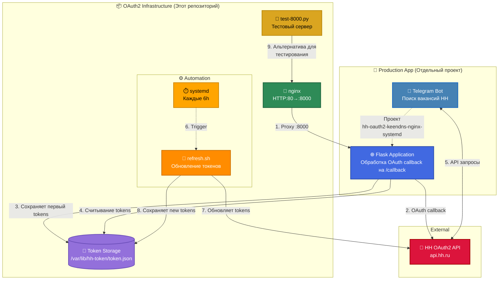

# 👋 Привет! Я Александр Добрынин

**DevOps/SRE-инженер** с 3+ годами опыта построения отказоустойчивой инфраструктуры  
📍 Москва | 🏠 Remote-friendly | 🇷🇺 Русский

---

## 🛠️ Технологический стек

**Инфраструктура:** Linux (Debian/Ubuntu), Proxmox VE/PBS, Docker, KVM/LXC  
**Автоматизация:** Bash, systemd, GitHub Actions, CI/CD  
**Базы данных:** PostgreSQL (репликация, backups)  
**Сети:** nginx, VLAN, DNS, TLS (Let's Encrypt)  
**Мониторинг:** Alarms, logging, capacity planning  

**В изучении:** Kubernetes, Terraform, Ansible, Prometheus/Grafana

---

## 🚀 Проекты

### [OAuth2 Infrastructure Automation](https://github.com/do6pbln9l/hh-oauth2-keendns-nginx-systemd)
Автоматизация OAuth2-инфраструктуры для HeadHunter API:
- ✅ CI/CD через GitHub Actions (ShellCheck, Docker build/push в GHCR)
- ✅ Автообновление токенов через systemd timers (каждые 6 часов)
- ✅ nginx reverse-proxy + KeenDNS + Let's Encrypt
- ✅ Infrastructure as Code (все конфигурации в Git)

**Технологии:** Docker, GitHub Actions, systemd, nginx, OAuth2

---

## 📊 Ключевые достижения

- ✅ **100% автоматизация** обновления OAuth2 токенов (было: вручную каждые 2 недели → стало: systemd timer каждые 6 часов)
- ✅ **Uptime 99.9%** за последние 6 месяцев (Proxmox VE HA-кластер, 3 ноды)
- ✅ **RTO < 30 минут** для восстановления сервисов (test-restores каждые 3 месяца)
- ✅ **CI/CD pipeline**: ShellCheck (100% compliance) + Docker автосборка в GHCR
- ✅ **Сокращение toil с 40% до 10%** через автоматизацию рутинных задач

---

## 🏗️ Архитектура

  
 Click to collapse

### 🖥️ View Mermaid diagram (desktop version)

  
 Click to expand

### Цветовая схема

- 🟢 Зелёный — инфраструктурные компоненты (nginx)
- 🟠 Оранжевый — автоматизация (systemd timer, Bash scripts)
- 🟡 Золотой — тестовые/вспомогательные инструменты (test-8000.py)
- 🟣 Фиолетовый — хранилище данных (Token Storage)
- 🔵 Синий — продакшен-приложение (Telegram Bot, Flask App)
- 🔴 Красный — внешние API (HeadHunter)

---

## 📫 Контакты

💼 HH.ru: [Резюме DevOps/SRE](https://hh.ru/resume/e2cf5fedff07cc20d30039ed1f494e42465951?from=share_ios)

💬 **Предпочитаемый способ связи:** Отклик через HH или email из резюме 

---

🏠 **Working from home** | 🌟 **Open to DevOps/SRE opportunities**
