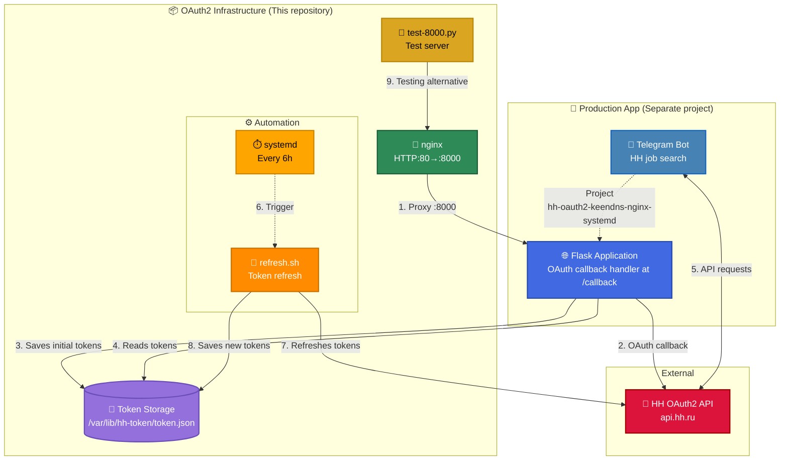

# 👋 Hi! I'm Aleksandr Dobrynin

**DevOps/SRE Engineer** with 3+ years of experience building fault-tolerant infrastructure  
📍 Moscow | 🏠 Remote-friendly | 🇷🇺 Russian

---

## 🛠️ Technology Stack

**Infrastructure:** Linux (Debian/Ubuntu), Proxmox VE/PBS, Docker, KVM/LXC  
**Automation:** Bash, systemd, GitHub Actions, CI/CD  
**Databases:** PostgreSQL (replication, backups)  
**Networking:** nginx, VLAN, DNS, TLS (Let's Encrypt)  
**Monitoring:** Alarms, logging, capacity planning  

**Currently learning:** Kubernetes, Terraform, Ansible, Prometheus/Grafana

---

## 🚀 Projects

### [OAuth2 Infrastructure Automation](https://github.com/do6pbln9l/hh-oauth2-keendns-nginx-systemd)
OAuth2 infrastructure automation for HeadHunter API:
- ✅ CI/CD via GitHub Actions (ShellCheck, Docker build/push to GHCR)
- ✅ Automated token refresh via systemd timers (every 6 hours)
- ✅ nginx reverse-proxy + KeenDNS + Let's Encrypt
- ✅ Infrastructure as Code (all configs in Git)

**Technologies:** Docker, GitHub Actions, systemd, nginx, OAuth2

---

## 📊 Key Achievements

- ✅ **100% automation** of OAuth2 token refresh (was: manual every 2 weeks → now: systemd timer every 6 hours)
- ✅ **99.9% uptime** over the last 6 months (Proxmox VE HA cluster, 3 nodes)
- ✅ **RTO < 30 minutes** for service recovery (test-restores every 3 months)
- ✅ **CI/CD pipeline**: ShellCheck (100% compliance) + automated Docker builds to GHCR
- ✅ **Reduced toil from 40% to 10%** through automation of routine tasks

---

## 🏗️ Architecture

  
Click to collapse

### 🖥️ View Mermaid diagram (desktop version)

  
Click to expand

  

  
### Color Legend

- 🟢 Green — infrastructure components (nginx)
- 🟠 Orange — automation (systemd timer, Bash scripts)
- 🟡 Gold — testing/auxiliary tools (test-8000.py)
- 🟣 Purple — data storage (Token Storage)
- 🔵 Blue — production application (Telegram Bot, Flask App)
- 🔴 Red — external APIs (HeadHunter)

---

## 📫 Contact

💼 HH.ru: [DevOps/SRE Resume](https://hh.ru/resume/e2cf5fedff07cc20d30039ed1f494e42465951?from=share_ios)

💬 **Preferred contact method:** Apply via HH or email from resume 

---

🏠 **Working from home** | 🌟 **Open to DevOps/SRE opportunities**

