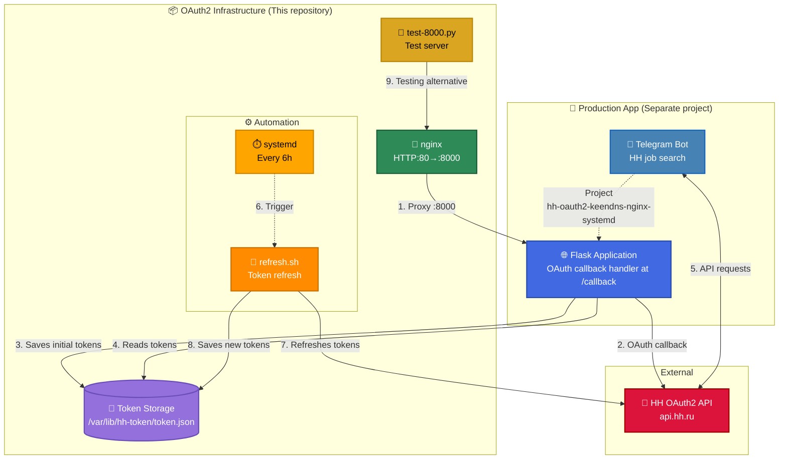

# 👋 Hi! I'm Aleksandr Dobrynin
**DevOps/SRE Engineer** with **3+ years** of experience building fault-tolerant infrastructure and automating CI/CD processes. Achieved **99.9% uptime** over 6 months with Proxmox VE HA cluster. Practical experience with **ML/Computer Vision** infrastructure (Frigate, YOLO, face recognition). SRE approach: runbooks, RTO/RPO metrics, monitoring, automation-first mindset. Reduced operational toil from 40% to 10% through systematic automation.

📍 Moscow | 🏠 Remote-friendly | 🇷🇺 Russian
---

## 🛠️ Technology Stack

**Infrastructure:** Linux (Debian/Ubuntu), Proxmox VE/PBS HA cluster (3 nodes), Docker, KVM/LXC, HP iLO  
**Automation:** Bash, systemd, GitHub Actions, CI/CD  
**Databases:** PostgreSQL (replication, backups)  
**Networking:** nginx (reverse-proxy, TLS termination), VLAN segmentation, DHCP, DNS (AdGuard Home), KeenDNS, Let's Encrypt, NTP, iptables/firewall  
**Storage:** ZFS, Ceph  
**Monitoring:** Dashboards (CPU/RAM/Disk/GPU), alerting (Telegram Bot), centralized logging, capacity planning  
**ML/Computer Vision:** Frigate, YOLO, Doubletake, Compreface, Docker-based model serving, MQTT integration  
**API & Integrations:** REST API, OAuth2, Modbus/TCP, Zigbee2MQTT, Telegram Bot API  
**Security:** SSL/TLS automation, secrets management, firewall policies

**Hands-on practice in lab environment:** Kubernetes/Helm, Terraform, Ansible, Prometheus/Grafana, GitLab CI, Python (Flask/FastAPI)

---

## 🚀 Projects

### [OAuth2 Infrastructure Automation](https://github.com/do6pbln9l/hh-oauth2-keendns-nginx-systemd)
OAuth2 infrastructure automation for HeadHunter API:
- ✅ **CI/CD via GitHub Actions**: ShellCheck linting, nginx validation, Docker build/push to GHCR
- ✅ **Automated token refresh** via systemd timers (every 6 hours, 100% automation)
- ✅ **Reverse-proxy setup**: nginx + KeenDNS + Let's Encrypt (90-day cert auto-renewal)
- ✅ **Infrastructure as Code**: all configs version-controlled in Git
- ✅ **Container versioning**: SemVer tagging (1.0.0, latest) published to GHCR
- ✅ **Architecture documentation**: Mermaid diagrams with detailed component interaction

**Technologies:** Docker, GitHub Actions, GHCR, systemd, nginx, OAuth2, Bash, Let's Encrypt, KeenDNS
---

### 🤖 ML/Computer Vision Production Infrastructure

Production-ready ML infrastructure for real-time video analytics:

- ✅ **Frigate + YOLO** object detection in Docker (8+ video streams, 99.9% uptime)
- ✅ **Doubletake + Compreface** face recognition (trained on 150+ photos, accuracy 98%, recall 95%)
- ✅ **ML optimization**: precision improved from 75% to 92%, false positives reduced by 85%
- ✅ **Automated model serving** via Docker + Python + REST API + MQTT
- ✅ **GPU monitoring** and inference metrics tracking
- ✅ Full ML lifecycle implementation: data preparation → training → serving → monitoring → optimization

**Technologies:** Frigate, YOLO, Doubletake, Compreface, FaceNet, MTCNN, Docker, MQTT, Python, REST API, TensorFlow Lite, GPU inference

---

## 📊 Key Achievements

- ✅ **Reduced deployment time by 96%**: 2 days → 2 hours via Docker containerization and CI/CD
- ✅ **Reduced operational toil by 75%**: from 40% → 10% through automation of routine tasks
- ✅ **99.9% infrastructure uptime** over the last 6 months (Proxmox VE HA cluster, 3 nodes)
- ✅ **RTO < 30 minutes** for critical VM recovery (verified via quarterly test-restores)
- ✅ **RPO < 1 hour** via snapshot management and incremental backups
- ✅ **Network load reduced by 15%** through AdGuard Home DNS filtering
- ✅ **ML model optimization**: precision 75% → 92%, false positives reduced by 85%
- ✅ **CI/CD pipeline**: ShellCheck (100% compliance) + automated Docker builds to GHCR
- ✅ **100% automation** of OAuth2 token refresh (manual every 2 weeks → systemd timer every 6 hours)

---

## 🏗️ Infrastructure at Scale

**Proxmox VE HA Cluster:**
- 3-node cluster with automatic failover and quorum configuration
- 15+ virtual machines (Ubuntu/Debian)
- 20+ LXC containers for service isolation
- ZFS/Ceph storage backend
- Daily incremental + weekly full backups via Proxmox Backup Server
- HP iLO remote management for physical servers

**Network Architecture:**
- 10+ VLAN segments (management, production, DMZ, guest)
- 50+ managed devices with DHCP reservations and MAC binding
- nginx reverse-proxy with TLS termination
- AdGuard Home DNS filtering (15% network load reduction)
- NTP synchronization (<10ms accuracy) for distributed logging

**Observability:**
- Custom dashboards: CPU/RAM/Disk/GPU utilization, network metrics, service health
- Telegram alerting: CPU > 80%, Disk > 90%, service downtime
- Centralized logging with 30-day hot / 90-day cold retention
- Capacity planning based on trend analysis

---

## 🏗️ Architecture

  
Click to collapse

### 🖥️ View Mermaid diagram (desktop version)

  
Click to expand

  

  
### Color Legend

- 🟢 Green — infrastructure components (nginx)
- 🟠 Orange — automation (systemd timer, Bash scripts)
- 🟡 Gold — testing/auxiliary tools (test-8000.py)
- 🟣 Purple — data storage (Token Storage)
- 🔵 Blue — production application (Telegram Bot, Flask App)
- 🔴 Red — external APIs (HeadHunter)

---
## 📌 Popular repositories

1. **hh-oauth2-keendns-nginx-systemd**  
   Automated OAuth2 infrastructure for HeadHunter API with reverse-proxy nginx and systemd timers

2. **do6pbln9l**  
   DevOps/SRE Engineer | Linux, Docker, CI/CD | 🏠 Remote

---

## 📫 Contact

💼 HH.ru: [DevOps/SRE Resume](https://hh.ru/resume/e2cf5fedff07cc20d30039ed1f494e42465951?from=share_ios)

💬 **Preferred contact method:** Apply via HH or email from resume 

---

🏠 **Working from home** | 🌟 **Open to DevOps/SRE opportunities**

